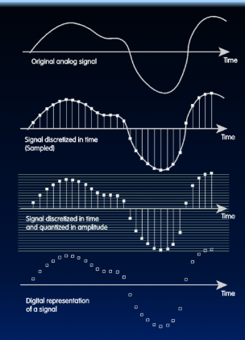

# 数的表示

## 简介

Data input: Analog → Digital

现实世界是模拟的（Analog）！

为了把模拟信息导入计算机，我们必须完成两件事情：

1. **采样（Sample）**

例如：
对于 CD 音频，我们每隔 1/44100 秒，就询问一次音乐信号当前“有多响”。

2. **量化（Quantize）**

对于每一次采样，我们都要确定它在一个 16 位（即 65,536 个刻度）的“标尺”上的位置。

> 重要思想：二进制位能够表示一切！！

With N bits, you can represent at most $2^N$ things.

例如:
- Logical values? => 1 bit
    One possible convention: 0 -> False, 1 -> True

- Characters?

    - A, …, Z -> 26 letters → 5 bits (26 ≤ 32)
    - ASCII: upper/lower case + punctuation → 7 bits → round to 1 byte
    - Unicode (www.unicode.com): standard code to cover all the worldʼs languages ⇒ 8, 16, 32 bits

- Colors?
    - HTML color codes: 24 bits (3 bytes)

- Locations / addresses?
    Commands?
    - IPv4 (32 bit), IPv6 (64 bit), etc.

## 二进制、十进制，十六进制